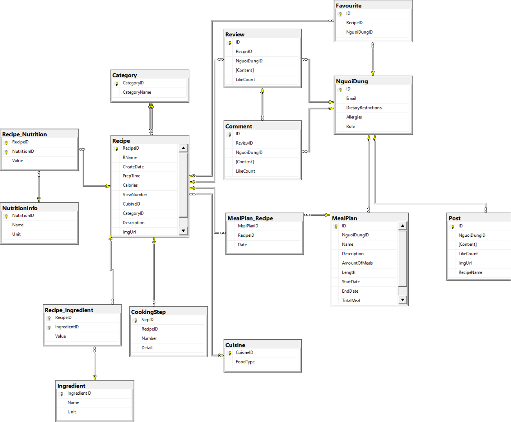

# Food Social Networking App

## Project Introduction
The application provides features such as sharing images and reviews of food, creating and joining cooking communities, generating suitable meal plans, as well as searching for and saving favorite recipes

## Team Members

| ID        | Name         | Contribution %  |
| :-------- | :----------- | :-------------- |
| 21521847  | Trần Xuân Bằng | 100 |
| 21520597  | Võ Hồng Kim Anh | 100 |
| 21521086  | Hoàng Gia Lộc | 100 |
| 21520191  | Vũ Thanh Doan | 100 |

## Technologies Used

- **Frontend**: Flutter, Dart
- **Backend**: Swagger, ASP.NET, Firebase
- **Database**: SQL Server
- **Tools**: Figma, Draw.io, StarUML, Git/Github

## Database Schema 

## Main Features of the Website
----------------
### Main Features for Users
> * Login / Register (API Token)
> * Create/Like/Comment Posts on Community
> * Search/View/Saved Recipes
> * Create/View/Choose Meal Plan
> * Manage Own Profile

### Main Features for Admins
> * Dashboard
> * Manage Posts/Recipes
> * Add/Change Recipes
> * Manage Users
> * Create Reports

